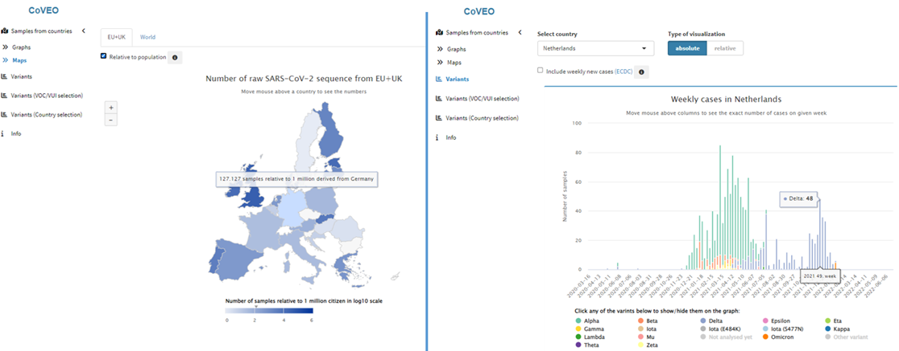

# CoVEO

## Background

Covid-19 Data Portal variant browser application

CoVEO was developed by the VEO consortium and integrated within the Covid-19 Data Portal at EMBL-EBI (https://www.covid19dataportal.org/coveo). This includes an underlying PostgreSQL database which was updated with an unfiltered VCF and coverage file per sample processed in the systematically analysed dataset.

* Publication: Nadim Rahman et al.: **Mobilisation and analyses of publicly available SARS-CoV-2 data for pandemic responses** *Microbial Genomics:* https://doi.org/10.1099/mgen.0.001188

The CoVEO app presents an interactive visualisation on graphs and maps about the number of raw SARS-CoV-2 sequences submitted by countries across the world and the distribution of variants across time. Users can even input an inclusion/exclusion list of mutations of the S protein, with the app showing the distribution of samples containing the custom-selected mutations across time grouped by country. By enabling focus on samples with sufficient sequencing depth on predefined positions, a unique approach is provided to users.

## Usage

## Requirements

## Installation and Setup

### Configuration
